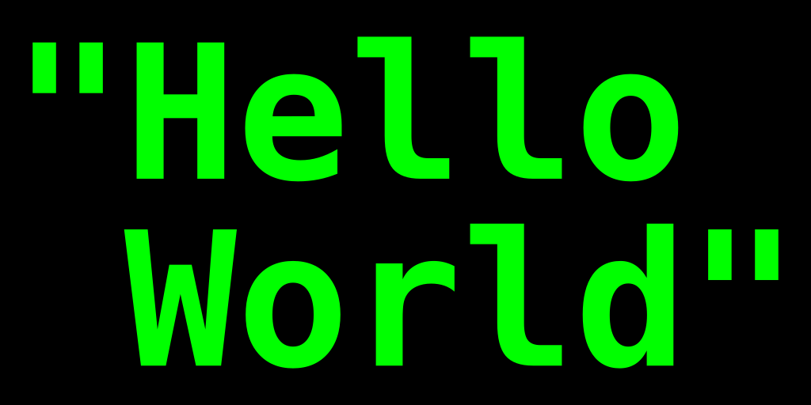

<!-- @format -->

## Introduction {-}

Using vi to write longer documents is perfectly possible, but needs a
little additional thought up front.
[grok-ing](https://stackoverflow.com/questions/1218390/what-is-your-most-productive-shortcut-with-vim)
vi not only allows you to move around efficiently, but also effectively
edit and restructure text.

*Fluently speaking vi* allows you leverage the huge amount of power in
vanilla `vi`. Instead of installing hundreds of plugins, minimal
configuration can provide the same functionality without sacrificing
speed or compatibility. For instance a reasonable analogue `goyo` might
be achieved by removing the ruler and line numbers. Does this look as
pretty as the `goyo` results? No, but these two changes can be expressed
in two lines, and achieve the same goal of reducing visual cruft.
Plugins are a personal choice however. There are some that I simply
wouldn't be without. For instance the combination of `vim-pandoc` and
`vim-pandoc-syntax` are hard to beat. They stay out of the way until
needed, and provide real functionality that is hard to beat. Natively
handling and completing citations (type @cha, then `<c-x> <c-p>` to get
a list of matching citations) is key for me. Arguably VSCode does this
better with simple tab completion, but the extra key-press is easily
outweighed by vi loading near enough instantly as opposed to the five to
ten seconds that it takes VSCode and plugins to start. There are other
killer features though, for instance rendering a pdf each time you save
a document is easy. This repo has its' own `build` script that can be
used:

``` vim
if empty(glob('./build'))
 let g:pandoc#command#autoexec_command = "Pandoc! pdf"
else
 let g:pandoc#command#autoexec_command = ":silent !./build silent"
 endif
```

Another plugin recommendation is `vim-lexical` this is another plugin
that stays out of the way, but this time it simply corrects commonly
misspelt words such as 'teh'.

## Why use a text editor over Word {-}

Word is a great tool. Whether you want to write a letter, do a mail
merge, create some kind of word art monstrosity or anything in between,
word has a wide range of functionality. The majority of this
functionality is very much in your face however. Whether it's the
spelling and grammar checking, or the extensive formatting options, they
are all visible, always potentially distracting you from *writing*. In
contrast, with `vi`, you are explicitly either writing or editing text.
The visual distractions are minimal, and can be reduced even further
through pretty minimal configuration. The editing in vi feels more
precise too; cutting and pasting a sentence can be done with `(d)` then
`p` rather than pfaffing around with a mouse, or `Ctrl+Shift` key
combinations.

## Using Markdown {-}

Using a lightweight markup language such as `markdown` means formatting
is a trivial case of adding the relevant mars such as \_\_ for italics,
or \## for a second level heading. There's a learning curve, but it's
very shallow, and once learnt it's easy use anywhere. Markdown helps
further abstract *writing* and *editing* and *formatting*. Formatting is
important, but it's typically something you'd want to consider *after
you've written* rather than during the writing process. A second benefit
to markdown is that it's easy to read, edit, and store. There's no
complex file type here, it's purely a text file with a `.md` extension.

Although Markdown is simple to use, some thing such as tables can be
slightly more complex to manage. The below table looks like this:

``` text
| Don't | Open |
|-------|--------|
| Dead | Inside |
```

in the source file. Pipes and hyphens are used to build the table. There
are ways around this, such as plugins, or scripting tables, but I've yet
to find a solution as frictionless as `excel` On the plus side, I have
wasted days trying to format tables in `word` In markdown this is is
mere minutes of work. as a bonus, using `: your text here` syntax, it's
a doddle to caption the tables. Using pandoc, this syntax filters
through to base `LaTeX` syntax, meaning it'll appear if you use the
`lot` tag in YAML.

| Don't | Open   |
|-------|--------|
| Dead  | Inside |

: here'sa figure for the table

Code blocks are something i've never seen done well in Word. In basic
markdown stylesheets, they look OK, but applying standard filters in
pandoc, they look great; syntax highlighting is good, and the resulting
code blocks look, well, like *code* for instance a for loop in bash:

``` bash
for i in {0..9}
 do echo $i
done
```

The same loop in Python

``` python
for i in range(0,9):
 print($i)
```

Not a for loop, not a programming language, but still presented
correctly...

``` sql
select sysdate from dual
```

### Handling lists in Markdown {-}

Vanilla markdown makes handling lists easy. If you've ever wrestled with
Word second guessing what you are trying to do with lists, and getting
it horribly wrong (*Continue numbering* and orphaned styles are personal
bugbears) it's a breath of fresh air to...

``` text
+ represent
+ bullet-points
 + like
 + this
```

which renders as you'd expect:

- represent
- bullet-points
- like
- this

Numbered lists are more complex, but follow the same understandable
rules around indentation with the bonus of not needing to remember what
number you are on:

``` text
1. numbered
1. lists
1. for the win
```

1.  numbered
2.  lists
3.  for the win

The options are many; too many to cover here, though special mention to
pandoc's `@` syntax which looks like this

``` text
@) numbered
@) lists

split by text

@) work with special syntax
```

@) numbered @) lists

split by text

@) work with special syntax

Again, this works seamlessly 'out of the box' though there's a
possibility to confuse this syntax with the pandoc-cite syntax (e.g. )

- how about a test of vim-pandoc's hard, automatic wrapping option
  (`hA`) this should kick in at column 79
- fingers crossed it does..!
- success..!

*some useful tests / syntax...*

- *italic*
- **bold**
- \[small caps\]{.smallcaps}
- <http://simple_url_render.com>
- [more complex url render](http://example.com)
- [my email](mailto:email@address.com)
- reference link [example](https://james-lemin.com "my website")
- Super^script^
- Sub\~script\~
- $tex$ math formulae $f(x) = x^2$
- ~~strike through~~

DefinitionTerm

: Definition

{height=200px}

### A level-three heading with a [link](/url) and *emphasis*

Veniam veldt okay cat quis culpa ex cupid tat Lorem nulla qui. Officia
qua nisi esse et sint velit incididunt. Dolore non dolore quis officia.

## Conclusion {-}

Adipisicing magna ad proident Lorem aliqua quis Ali quip Epsom sent.
Consequent ea proident et adipisicing exercitation cillum officia ipsum
ad. Minim in commodo parader dolour Loren qua auto temper. Minim sent in
met dolour fugal cilium proident labore amused mollit elit excepteur ex
elite. Dews ease excerpter labium nostrud veniam incident anim aliqua
proident ea Ali quip inure ad. Arte consecrator ullamco amet non. Est
eiusmod occaecat culpa pariatur eu dolore. @botton_seeing_2005. See
[here](foo) for more info

## Glossary {-}

Lorem amet magna et ex amet voluptate. Est excepteur sint labore
reprehenderit eu reprehenderit anim cillum laborum pariatur aliquip
proident pariatur do. Est dolor amet anim nulla fugiat veniam nostrud
nulla. Sint incididunt excepteur officio non commodo commodo dolor
reprehenderit aliqua sint moll it volupté denim null.
