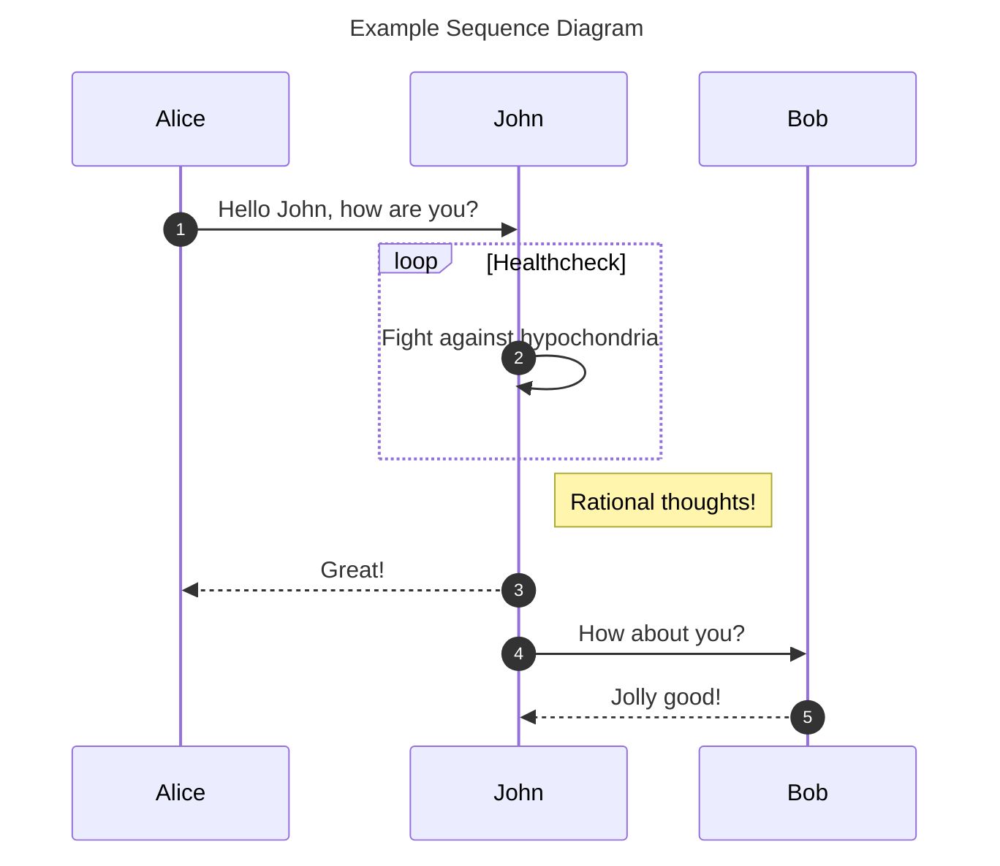
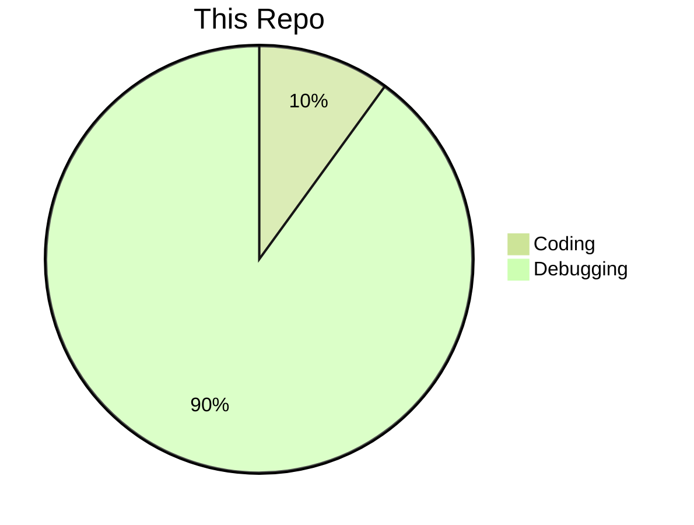
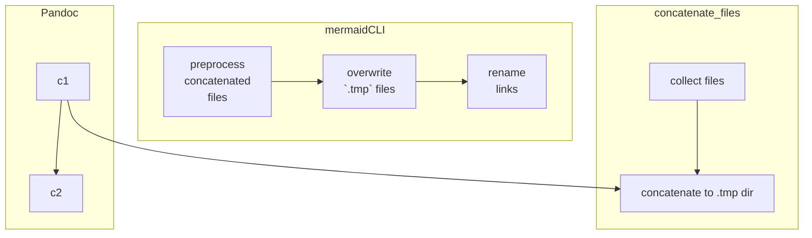
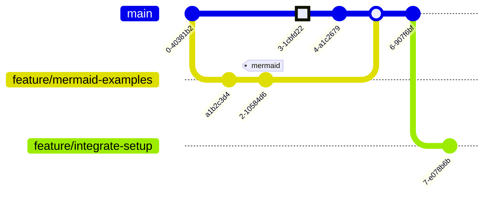
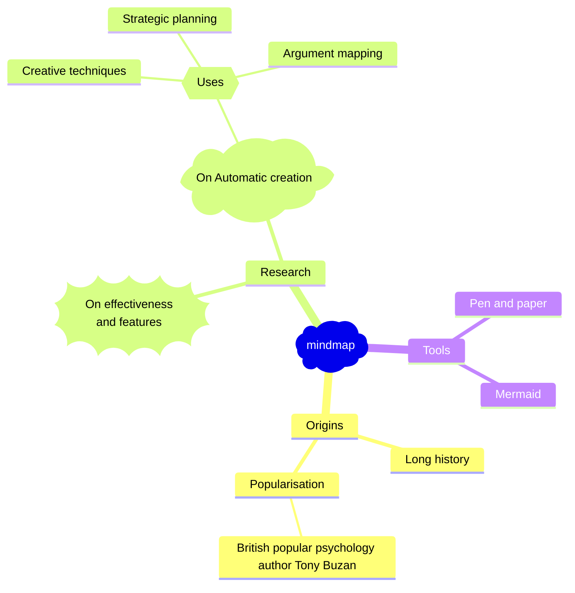

## Using Mermaid Diagrams {-}

Mermaid diagrams can be used to create reasonable-looking diagrams. To do  
this, use the mermaid-cli to pre-process the markdown file, and  
then use pandoc to convert the markdown to the desired format. The command is:

```bash
mmdc -i input.md -o output.md
```
or call npx directly:

```bash
npx -p @mermaid-js/mermaid-cli mmdc -i input.md -o output.md
```
The build script takes the second approach

There's a few things to note here:

1.  the preprocessor will replace the mermaid code with a link to the diagram
    image \_in the `.tmp` directory
2.  the preprocessor will add a generic caption text to the image
3.  image sizing isn't considered; use pandoc to resize the image
4.  the preprocessor will output svg images by default. These seem to render
    incorrectly, so we'll use pngs instead

### Mermaid Examples

- Most charts allow a title to be set using `title <your title>`a notable
  exception is flowchart (graph).  Adding a title to a flowchart will cause
  mermaid-cli to raise an error
- we can add a description which will work seamlessly with
  `accDescr <your description here`
- font-awesome icons can be simply be added using this syntax:
  `::icon(fa fa-book)`
- override themes, styling and other low-level mermaid parameters using
  directives, e.g., `%%{init: { 'theme': 'forest' } }%% `

### Sequence Diagram



### Pie Chart



### Flowchart



### Git Graph



### mindmap


